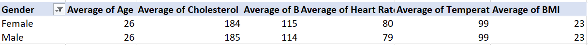
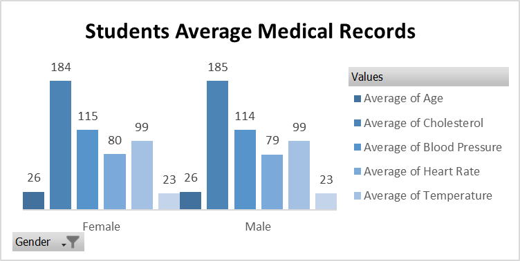
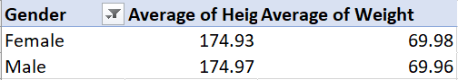
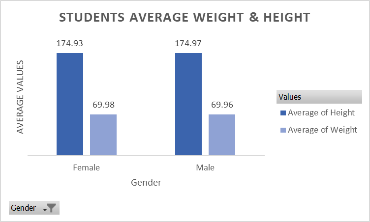
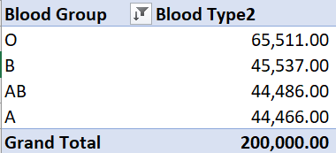
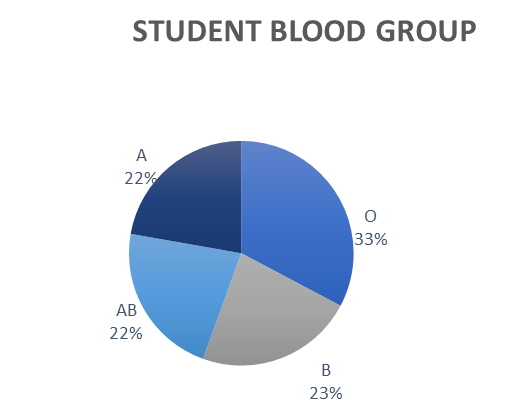
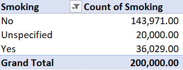
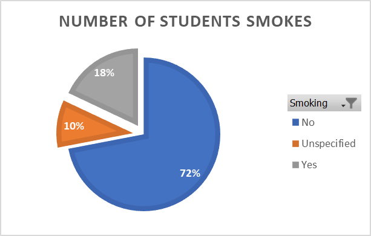
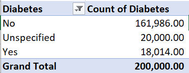
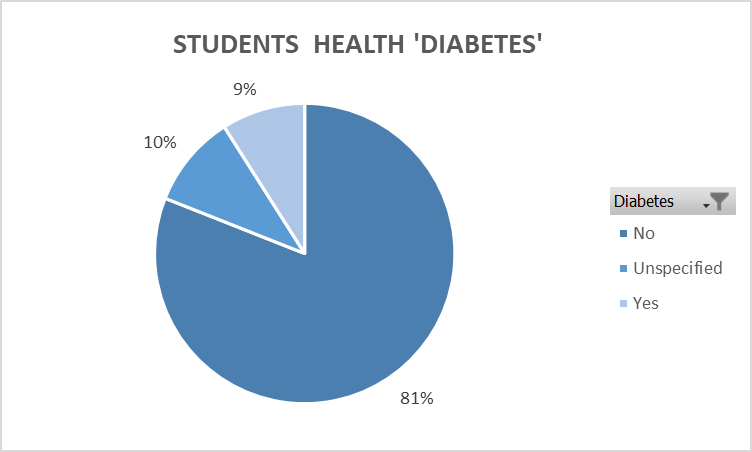

# Medical student record analysis

## Introduction 
This task is to demonstrate my knowledge and skills in data analysis using advanced Excel functions, such as pivot table and pivot charts.

## Problem Statement
1.	What are the average values for the following for Males and Females (Age, BMI, Temperature, Heart Rate, Blood Pressure, and Cholesterol)?
2.	What is the Average Height and Weight for both Genders (in 2 decimal places)?
3.	What is the number of students across the different Blood Groups?
4.	What is the number of Students who smoke and those who don’t?
5.	What is the number of Students who have diabetes and those who don’t?

## Data Sourcing
This data was obtained from the medical students in Data Analytics. The data contains 1 sheet with a table containing 200,000 rows and 13 columns.

## Data Transformation & Cleaning
The data was cleaned and filtered to make it easier to analyze. This included adding the average number to the missing values in number columns, and unspecified to the smoking and diabetes columns, and formatting the text and number types to ensure the data would not return errors.

## Analysis & Visualisation

**What are the average values for the following for Males and Females (Age, BMI, Temperature, Heart Rate, Blood Pressure, and Cholesterol)?**
The table and chart show that the average male and female have the same age and similar health statistics, including cholesterol, blood pressure, heart rate, temperature, and BMI.
Average Values                 |             Visualization Chart
:-----------------------------:|:--------------------------------:
     |              

## What are the Average Height and Weight for both Genders (in 2 decimal places)?
The table and chart show that the difference in height and weight between male and female students is not significant and that both groups of students are generally healthy.

Average Values                       |             Visualization Chart
:-----------------------------------:|:--------------------------------:
          |           

## What is the number of students across the different Blood Groups?
The majority of students have blood group O, while blood groups A and AB have the same number of students.

Count Values                       |             Visualization Chart
:---------------------------------:|:--------------------------------:
            |           

## What is the number of Students who smoke and those who don’t?
The chart shows that the majority of students are non-smokers, accounting for 72% of the total student population. Smokers make up 18% of the student population, and 10% of the student population is not specified.

Count Values                       |             Visualization Chart
:---------------------------------:|:--------------------------------:
            |           

## What is the number of Students who have diabetes and those who don’t?
Based on the chart below, only 9% of students have diabetes, and 10% have an unspecified illness. The majority of students, 81%, do not have diabetes, which means they are 
in good health.
Count Values                       |             Visualization Chart
:---------------------------------:|:--------------------------------:
                |           

## Conclusion And Recommendations
Most male and female students are in good health, but the university should still regularly check their health and encourage them to maintain a healthy lifestyle.

